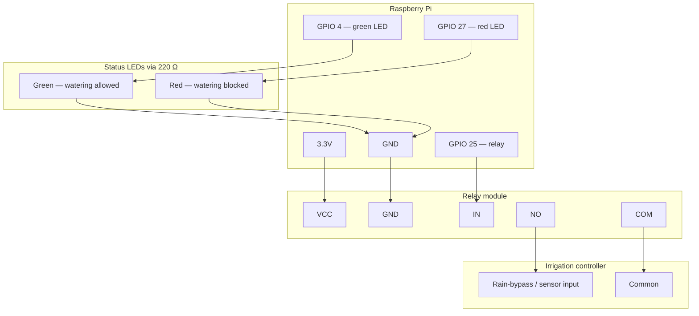

# Sprinkler Rain Bypass

Raspberry Pi controller that checks recent rainfall (Visual Crossing) and drives a relay plus status LEDs for your irrigation rain-bypass input.

Get a free API key at [Visual Crossing](https://www.visualcrossing.com/weather-api).

## Setup

On a Raspberry Pi (or Linux), run the interactive installer — it creates a venv, prompts for all settings, validates your API key, and optionally installs systemd:

```bash
git clone https://github.com/grevelle/sprinkler-rain-bypass.git
cd sprinkler-rain-bypass
chmod +x install.sh
./install.sh
```

Manual setup (or development off the Pi):

```bash
pip install -e ".[dev,gpio]"    # use [gpio] on the Pi
cp settings.example.toml settings.toml   # edit coordinates, pins, API key
```

`settings.example.toml` is the canonical default config. Tests and `rain_bypass.settings_io` derive settings from it. Run `./install.sh` (or `rain-bypass-install`) for the interactive setup wizard.

## Run

```bash
python -m rain_bypass --once   # single check
python -m rain_bypass          # loop
```

Use `gpio.mock = true` in settings to develop off the Pi.

## Config (`settings.toml`)


| Section    | Keys                                                                                                                                                                                                                                  |
| ---------- | ------------------------------------------------------------------------------------------------------------------------------------------------------------------------------------------------------------------------------------- |
| `location` | `latitude`, `longitude`, `timezone` (IANA name, e.g. `America/Chicago`)                                                                                                                                                               |
| `watering` | `inches_required`, `past_days`, `forecast_days`, `forecast_inches_max`, `event_inches`, `rain_delay_days`, `near_term_hours`, `near_term_inches_max`, `freeze_skip`, `freeze_temp_f`, `check_hour`, `check_minute`, `updates_per_day` |
| `sewer`    | `start_month/day`, `end_month/day` — hard block window (annual sewer cap)                                                                                                                                                             |
| `weather`  | `api_key` (Visual Crossing Timeline API)                                                                                                                                                                                              |
| `gpio`     | `relay`, `watering_enabled_led`, `watering_disabled_led`, `mock`                                                                                                                                                                      |
| `runtime`  | `state_path`, `fail_mode`, `log_level`, `weather_timeout_seconds`                                                                                                                                                                     |


`fail_mode`: `disable_watering` (default) or `keep_last_state` when the weather API fails.

**Suggested starting values** (used by `./install.sh`): **Hartland, WI 53029** — **sewer lockout Jan 16–Mar 15** (city sets annual sewer cap from winter water use on the April bill). Irrigation schedule timing is left to your controller; this app only enforces the sewer window plus rain-skip logic.

### Sewer lockout

Many municipalities (including Hartland/Waukesha) set **annual sewer charges from water used January 16 through March 15** (shown on April utility bills). Any irrigation on the same water meter during that window increases your sewer bill for the **entire year**.

During the sewer lockout window:

- Watering is **hard blocked** — before weather checks or fail-mode logic.
- The relay stays in **block** mode; no API call is made.

### Weather behavior

The app uses **six gates** before allowing watering:

1. **Past window** — cumulative rain through today vs `inches_required` (Hydrawise).
2. **Rain event** — any single day in that window ≥ `event_inches` (UF/IFAS sensor; `0` = off).
3. **Forecast window** — sum from tomorrow through `forecast_days` vs `forecast_inches_max` (Rain Bird).
4. **Rain delay** — after a past-window block, stay off `rain_delay_days` (`blocked_until` in `state.json`).
5. **Near term** — hourly precip over the next `near_term_hours` vs `near_term_inches_max` (Rachio-style; `0` = off).
6. **Freeze skip** — block when today or tomorrow forecast low is below `freeze_temp_f` (protect heads/pipes).

Watering is allowed only when **all** gates pass and no active rain delay remains. One [Visual Crossing Timeline API](https://www.visualcrossing.com/resources/documentation/weather-api/timeline-weather-api/) request returns daily rows (and hourly rows when near-term is enabled). Daily `precip` is summed in **inches** (`unitGroup=us`).

**Check timing:** When `updates_per_day = 1`, the loop sleeps until the next `check_hour`:`check_minute` in `location.timezone` (default 4:30 AM — before most morning irrigation). With more than one check per day, checks are evenly spaced over 24 hours instead.

- **Today** in the past window may blend observed rain with forecast rain for the rest of the day (`source: comb` in the API). That can block watering before a storm arrives — usually what you want for a rain bypass.
- **API cost** is about one record per day returned plus one per hour when near-term is enabled (~`past_days + forecast_days + 24` per check). Set `log_level = "DEBUG"` to log `queryCost` each request.
- Match `location.timezone` to your coordinates; a mismatch with the API’s resolved timezone is logged as a warning.

## Code

Layered modules: `config`, `settings_io`, `windows`, `weather` (httpx), `logic`, `controller`, `gpio`, `cli`, and `install_cli`. Typer powers both `rain-bypass` and `rain-bypass-install`. `settings.example.toml` is the single source for defaults. CI runs pre-commit, Pyright (strict), and pytest at 100% coverage on Python 3.11 and 3.12.

## Development

Install dev dependencies, then enable pre-commit hooks locally (Ruff, format, ShellCheck — same as CI). Pyright runs against the installed package:

```bash
pip install -e ".[dev,gpio]"
pre-commit install
pre-commit run --all-files   # optional: run once without committing
pyright                      # strict typing on src/
```

See [CHANGELOG.md](CHANGELOG.md) for release history.

## Hardware

### Parts

- Raspberry Pi with network access
- GPIO breakout or breadboard
- 2× resistors (50–300 Ω), 1× 3.3 V relay module
- Green + red LED
- Irrigation controller with rain-bypass input

### Wiring diagram (default BCM pins)

Logic levels and pin numbers match `settings.example.toml`. Use **3.3 V** relay modules; many boards expose relay VCC on 5 V — check your module before wiring.


```mermaid
flowchart TB
  subgraph pi [Raspberry Pi]
    v33["3.3V"]
    gnd["GND"]
    gpio25["GPIO 25 — relay"]
    gpio4["GPIO 4 — green LED"]
    gpio27["GPIO 27 — red LED"]
  end

  subgraph relay [Relay module]
    rVCC["VCC"]
    rGND["GND"]
    rIN["IN"]
    rCOM["COM"]
    rNO["NO"]
  end

  subgraph leds [Status LEDs via 220 Ω]
    green["Green — watering allowed"]
    red["Red — watering blocked"]
  end

  subgraph controller [Irrigation controller]
    rainIn["Rain-bypass / sensor input"]
    rainCommon["Common"]
  end

  v33 --> rVCC
  gnd --> rGND
  gpio25 --> rIN
  rCOM --> rainCommon
  rNO --> rainIn

  gpio4 --> green
  gpio27 --> red
  green --> gnd
  red --> gnd
```

| GPIO signal | Pin | When HIGH / ON |
| ----------- | --- | -------------- |
| Relay IN | 25 | Watering **disabled** (relay energized — verify against your controller) |
| Green LED | 4 | Watering **allowed** |
| Red LED | 27 | Watering **blocked** |

Configure pins in `settings.toml` under `[gpio]`. Relay **COM/NO** (or your module’s dry-contact pair) goes to the controller’s rain-bypass terminals — same as a physical rain sensor would. Confirm whether your controller expects **normally open** or **normally closed** before leaving it unattended.

### Safety

Verify relay behavior with your controller before unattended use. Match relay rating to your bypass circuit.

## systemd

`./install.sh` can install the service with correct paths for your install directory. To install manually, edit `deploy/rain-bypass.service` (paths and `.venv` python), then:

```bash
sudo cp deploy/rain-bypass.service /etc/systemd/system/
sudo systemctl daemon-reload
sudo systemctl enable --now rain-bypass
```

## License

MIT