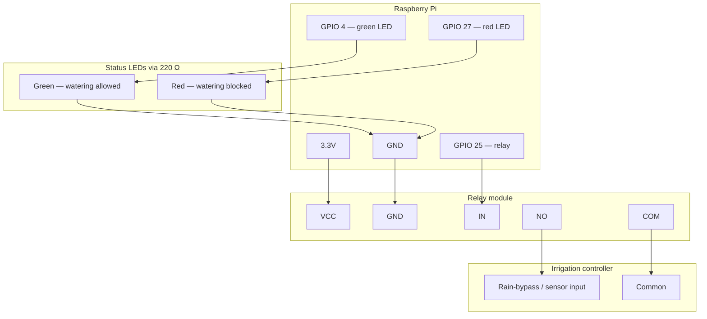

# Sprinkler Rain Bypass

Raspberry Pi controller that sets a rain-bypass relay **ON or OFF** before each irrigation cycle using seasonal Kentucky bluegrass balance, month-to-date rain, and forecast — plus freeze and storm safety gates.

**Target hardware:** Raspberry Pi Zero W (also works on other Pi models with BCM GPIO).

Get a free API key at [Visual Crossing](https://www.visualcrossing.com/weather-api).

## Setup

On a **Raspberry Pi Zero W**, use the **latest Raspberry Pi OS** (32-bit is fine). Run the interactive installer — it checks for missing apt packages (venv, git, build tools on the Pi), applies defaults from `settings.example.toml`, resolves your **ZIP code** to coordinates (default **53029**), and only requires your Visual Crossing **API key** (press Enter everywhere else):

```bash
git clone https://github.com/grevelle/sprinkler-rain-bypass.git
cd sprinkler-rain-bypass
chmod +x install.sh
./install.sh
```

Manual setup (or development off the Pi):

```bash
pip install -e ".[dev,gpio]"    # use [gpio] on the Pi
cp settings.example.toml settings.toml   # edit api_key (and zip_code if not 53029)
```

`settings.example.toml` is the canonical default config. Tests and `rain_bypass.settings_io` derive settings from it. Run `./install.sh` (or `rain-bypass-install`) for the interactive setup wizard.

**Change API key or ZIP later** (skips apt/pip — usually seconds):

```bash
chmod +x configure.sh   # once
./configure.sh
```

For other options (`check_hour`, `inches_per_cycle`, GPIO pins, etc.), edit `settings.toml` directly and restart the service:

```bash
nano settings.toml
sudo systemctl restart rain-bypass
```

### Pi Zero W notes

| Topic | Recommendation |
| ----- | -------------- |
| OS | Latest **Raspberry Pi OS** (keep the image updated) |
| Prerequisites | `./install.sh` checks for **python3-venv**, **git**, and on the Pi **python3-dev** + **build-essential**; offers `sudo apt-get install` if anything is missing |
| First install | `./install.sh` on a Zero W can take **10–20 minutes** (slow CPU + SD card) |
| Wi‑Fi | Stable connection required for Visual Crossing; default API timeout is **45 s** |
| GPIO library | **`RPi.GPIO`** — correct for Zero W’s classic BCM2835 GPIO |
| Relay module | **3.3 V** logic (see Hardware below) |
| systemd | Installer sets `MemoryMax=256M` and `Nice=5` for the 512 MB Zero W |

On boot the relay **blocks watering** until the first check completes, then restores the last saved state from `state.json` while fetching weather.

## Run

```bash
python -m rain_bypass --once   # single check
python -m rain_bypass          # loop
python -m rain_bypass status   # text dashboard (weather, balance, relay)
python -m rain_bypass status --cached   # saved state only; no API call
```

Use `gpio.mock = true` in settings to develop off the Pi.

## Config (`settings.toml`)


| Section    | Keys                                                                                                                                                                                                                                  |
| ---------- | ------------------------------------------------------------------------------------------------------------------------------------------------------------------------------------------------------------------------------------- |
| `location` | `zip_code` (default **53029**), plus resolved `latitude`, `longitude`, `timezone` from install |
| `balance`  | `inches_per_cycle` (calibrate with catch cups); optional `forecast_days`, `[balance.monthly]` overrides |
| `watering` | `check_hour`, `check_minute`; optional `event_lookback_days`, `event_inches`, `freeze_temp_f` |
| `sewer`    | `start_month/day`, `end_month/day` — hard block window (annual sewer cap)                                                                                                                                                             |
| `weather`  | `api_key` (Visual Crossing Timeline API)                                                                                                                                                                                              |
| `gpio`     | `relay`, `watering_enabled_led`, `watering_disabled_led`, `mock`                                                                                                                                                                      |
| `runtime`  | `state_path`, `fail_mode`, `log_level`, `weather_timeout_seconds`                                                                                                                                                                     |


`fail_mode`: `disable_watering` (default) or `keep_last_state` when the weather API fails.

**Suggested starting values** (used by `./install.sh`): **Hartland, WI 53029** — **sewer lockout Jan 16–Mar 15**; **`balance.inches_per_cycle = 0.3`** (30 min/zone ≈ 0.3 in per daily run). Schedule Rain Bird for **one program every day**; this app sets the bypass before that cycle.

### Rain Bird setup

1. Set **one program** with your zones and run times.
2. Schedule the program **every day** at your preferred morning time.
3. Wire the bypass relay to the rain-sensor terminals (COM/NO as a dry contact).
4. The Pi check runs at **4:30 AM** by default so the relay state is set **before** the morning cycle.
5. **Calibrate `[balance].inches_per_cycle`** once with a catch-cup test on a full program run.

Relay **open** (green LED) = dry sensor = watering **allowed**. Relay **closed** (red LED) = wet sensor = cycle **skipped**.

### Sewer lockout

Many municipalities (including Hartland/Waukesha) set **annual sewer charges from water used January 16 through March 15** (shown on April utility bills). Any irrigation on the same water meter during that window increases your sewer bill for the **entire year**.

During the sewer lockout window:

- Watering is **hard blocked** — before weather checks or fail-mode logic.
- The relay stays in **block** mode; no API call is made.

### How watering is decided

Two layers run each morning check:

1. **Seasonal balance** — prorated monthly Kentucky bluegrass target minus month-to-date rain, credited irrigation, and forecast must reach at least **`inches_per_cycle`** before the switch turns **ON**.
2. **Safety** — block on freeze (today/tomorrow low below `freeze_temp_f`) or a heavy rain day in the lookback (`event_inches`).

```text
watering_required = balance_ok AND safety_ok AND NOT sewer
```

There is **no weekly schedule** — each day recomputes one ON/OFF for the next cycle only. One [Visual Crossing Timeline API](https://www.visualcrossing.com/resources/documentation/weather-api/timeline-weather-api/) request returns daily rows; `precip` is summed in **inches** (`unitGroup=us`).

**Check timing:** The loop sleeps until the next `check_hour`:`check_minute` in `location.timezone` (default **4:30 AM**).

- Forecast rain reduces today’s balance before it falls (conservative). Tune `[balance].forecast_days` if the switch stays OFF too often.
- When the switch is **ON**, the model credits one `inches_per_cycle` to the month (it does not verify the panel actually ran).
- Set `log_level = "DEBUG"` to log `queryCost` each request.
- Match `location.timezone` to your coordinates; a mismatch with the API’s resolved timezone is logged as a warning.

### Upgrading from v4

Replace `settings.toml` from the new `settings.example.toml`. Removed keys include `inches_required`, `forecast_inches_max`, `near_term_*`, `rain_delay_days`, `updates_per_day`, and `past_days`. See [CHANGELOG.md](CHANGELOG.md).

## Code

Layered modules: `config`, `balance`, `settings_io`, `windows`, `weather` (httpx), `logic`, `controller`, `gpio`, `cli`, and `install_cli`. Typer powers both `rain-bypass` and `rain-bypass-install`. `settings.example.toml` is the single source for defaults. CI runs pre-commit, Pyright (strict), and pytest at 100% coverage on the latest Python 3.x.

## Development

Dependencies are **unpinned** — every install uses `pip install --upgrade` for the latest releases. Install dev dependencies once, then enable Git hooks so CI failures are caught **before** you push:

```bash
pip install -e ".[dev,gpio]"
pre-commit install   # commit: Ruff + ShellCheck; push: Pyright + pytest too
```

Run the same checks as GitHub Actions manually (recommended on Windows before every commit):

```powershell
.\scripts\ci.ps1
```

```bash
./scripts/ci.sh
```

If Ruff auto-fixes imports during a hook run, stage those edits and commit again. `.gitattributes` and `.editorconfig` keep **LF** line endings on all platforms (required for Pi and Linux CI). Hooks use latest pip packages (`ruff`, `shellcheck-py`) — nothing is version-pinned in config files.

Pyright alone: `pyright`

See [CHANGELOG.md](CHANGELOG.md) for release history.

## Hardware

### Parts

- **Raspberry Pi Zero W** (or any Pi with network access and BCM GPIO)
- GPIO breakout or breadboard
- 2× resistors (50–300 Ω), 1× 3.3 V relay module
- Green + red LED
- Irrigation controller with rain-bypass input

### Wiring diagram (default BCM pins)

Logic levels and pin numbers match `settings.example.toml`. Use **3.3 V** relay modules; many boards expose relay VCC on 5 V — check your module before wiring.


```mermaid
flowchart TB
  subgraph pi [Raspberry Pi]
    v33["3.3V"]
    gnd["GND"]
    gpio25["GPIO 25 — relay"]
    gpio4["GPIO 4 — green LED"]
    gpio27["GPIO 27 — red LED"]
  end

  subgraph relay [Relay module]
    rVCC["VCC"]
    rGND["GND"]
    rIN["IN"]
    rCOM["COM"]
    rNO["NO"]
  end

  subgraph leds [Status LEDs via 220 Ω]
    green["Green — watering allowed"]
    red["Red — watering blocked"]
  end

  subgraph controller [Irrigation controller]
    rainIn["Rain-bypass / sensor input"]
    rainCommon["Common"]
  end

  v33 --> rVCC
  gnd --> rGND
  gpio25 --> rIN
  rCOM --> rainCommon
  rNO --> rainIn

  gpio4 --> green
  gpio27 --> red
  green --> gnd
  red --> gnd
```

| GPIO signal | Pin | When HIGH / ON |
| ----------- | --- | -------------- |
| Relay IN | 25 | Watering **disabled** (relay energized — verify against your controller) |
| Green LED | 4 | Watering **allowed** |
| Red LED | 27 | Watering **blocked** |

Configure pins in `settings.toml` under `[gpio]`. Relay **COM/NO** (or your module’s dry-contact pair) goes to the controller’s rain-bypass terminals — same as a physical rain sensor would. Confirm whether your controller expects **normally open** or **normally closed** before leaving it unattended.

### Safety

Verify relay behavior with your controller before unattended use. Match relay rating to your bypass circuit.

## systemd

`./install.sh` installs the service with paths for your install directory. The unit template is `deploy/rain-bypass.service.in` (placeholders `@ROOT@`, `@PYTHON@`, `@SETTINGS@`, `@USER@`).

Manual install: substitute placeholders, then:

```bash
sed -e 's|@ROOT@|/opt/sprinkler-rain-bypass|g' \
    -e 's|@PYTHON@|/opt/sprinkler-rain-bypass/.venv/bin/python|g' \
    -e 's|@SETTINGS@|/opt/sprinkler-rain-bypass/settings.toml|g' \
    -e 's|@USER@|root|g' \
    deploy/rain-bypass.service.in | sudo tee /etc/systemd/system/rain-bypass.service
sudo systemctl daemon-reload
sudo systemctl enable --now rain-bypass
```

## License

MIT