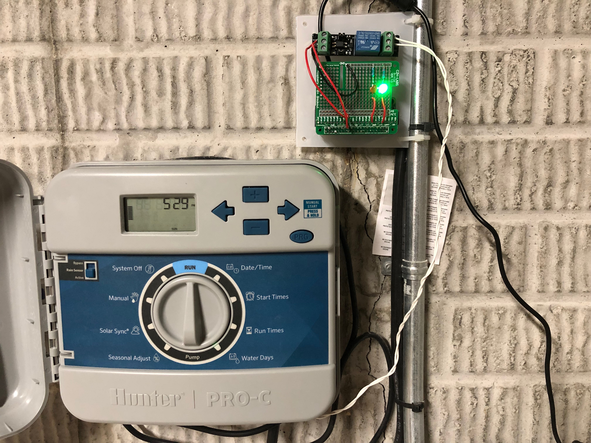
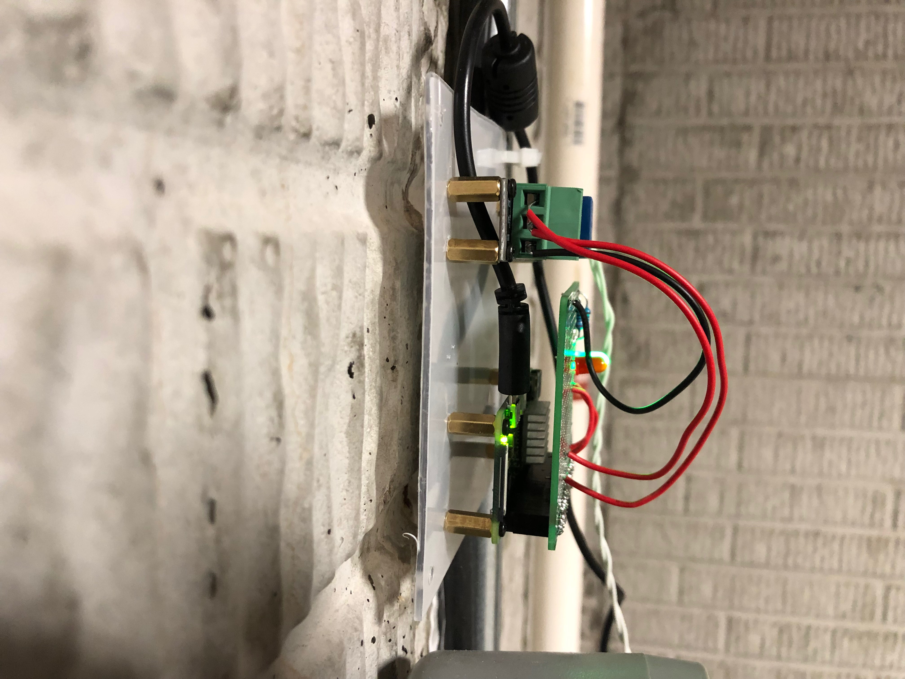

# Hardware

## Parts

- Raspberry Pi with network access
- GPIO breakout or breadboard
- 2× resistors (50–300 Ω), 1× 3.3 V relay module
- Green + red LED
- Irrigation controller with rain-bypass input

## Wiring (default BCM pins)

| Signal | Pin | Behavior |
|--------|-----|----------|
| Relay | 25 | HIGH = watering disabled |
| Green LED | 4 | ON when watering allowed |
| Red LED | 27 | ON when watering blocked |

Configure pins in `settings.toml` under `[gpio]`.

## Photos

## Safety

Verify relay behavior with your controller before unattended use. Match relay rating to your bypass circuit.
